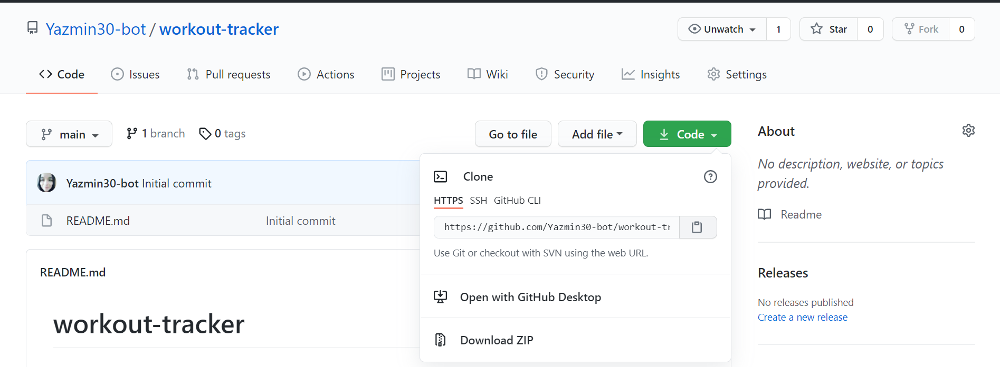
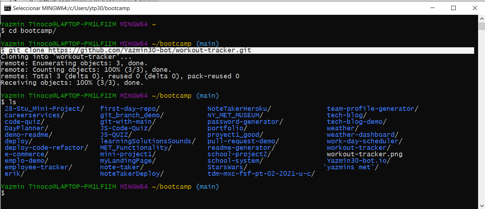

# Workout Tracker


## Description
  
  Create an application called Workout Tracker that can be used to to view create and track daily workouts, to log multiple exercises in a workout on a given day, to track the name, type, weight, sets, reps, and duration of exercise, and  to track my distance traveled if the exercise is a cardio exercise,
  * Uses the [Express package](https://www.npmjs.com/package/express).

  * Uses the [Mongoose package](https://mongoosejs.com/).

  * Uses the [Morgan package](https://github.com/expressjs/morgan#readme).

  
  
## Table of Contents
  
  *[Installation](#installation)
  
  *[Usage](#usage)
  
  *[Build-With](#build-with)

  *[Links](#links)

  *[Author](#author)
  
  *[Contributing](#contributing)
  
  *[Questions](#questions)

## Installation
  * Go to the following link [https://github.com/Yazmin30-bot/workout-tracker](https://github.com/Yazmin30-bot/workout-tracker/) and clone it 
  * Go to Git-bash and page the github's with the following code
    ```
    $ git clone https://github.com/Yazmin30-bot/workout-tracker.git
    ``` 
    
  * When you first set up the project before installing any dependencies, make sure that your repo includes a package.json with the required dependencies. You can create one by running 
    ```
    npm init
    ``` 
  * For this project is needed to add the inquirer dependency to package.json file  
    ```
      "dependencies": {
      "express": "^4.16.3",
      "mongoose": "^5.3.16",
      "morgan": "^1.9.1" }
    ``` 
    

  * To install necessary dependencies, run the following command:
    ```
    npm install
    npm install express
    npm install mongoose
    npm install morgan
    ```
## Usage
  * To seed the database from the use the  following command line

      ```
    npm run seed
    ```

  * The application will be invoked by using the following command:

    ```bash
    npm start
    ```
  * The following animation demonstrates the application functionality.  
    
   
## Build with 
  * [Javascript](https://www.javascript.com/) - `Javascript`
  * [NodeJs](https://nodejs.org/en/) - `NodeJs`

## Links
  * The URL of the deployed application.
  [https://morning-temple-42127.herokuapp.com/](https://morning-temple-42127.herokuapp.com/)
  * The URL of the GitHub repository.                                         [https://github.com/Yazmin30-bot/workout-tracker/](https://github.com/Yazmin30-bot/workout-tracker/)

## Author 
  * **`Yazmin Tinoco`**   - [Yazmin30-bot](https://github.com/Yazmin30-bot/)

## Contributing
  Pull requests are welcome. For major changes, please open an issue first to discuss what you would like to change. 


  
## Questions
  If you have any questions about the repo, open an issue or contact me directly at ytip30@gmail.com.
  You can find more of my work at [Yazmin30-bot](https://github.com/Yazmin30-bot/). 